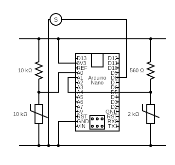
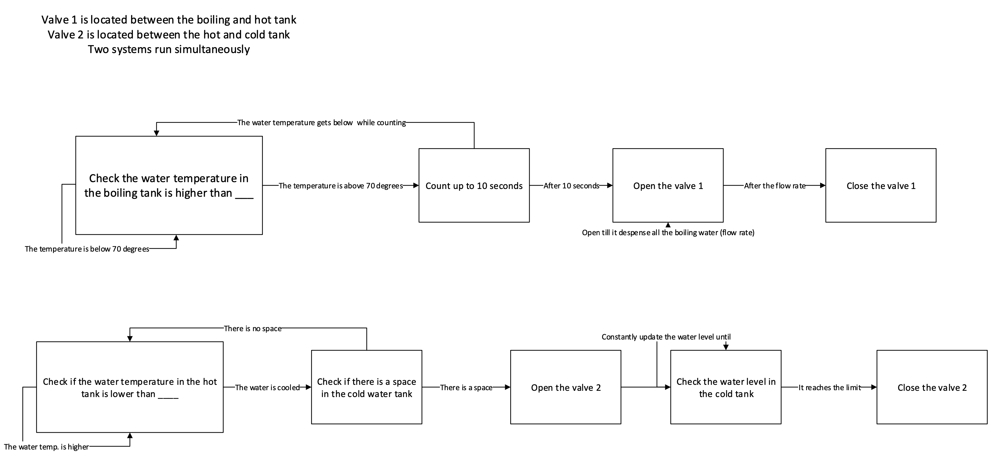
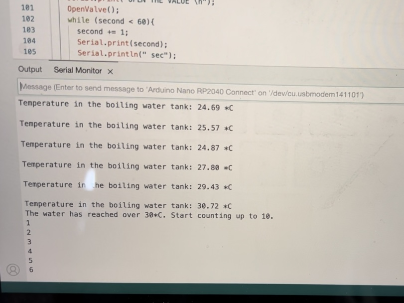
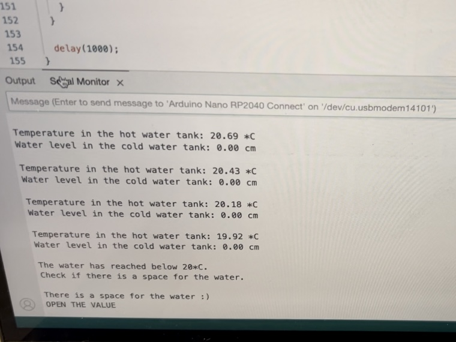

# Solar Spout
* Leverage local, grid-agnostic solar energy to enable water heating.
* Automated water movement through a piped system, including automated temperature-based valves.

## Automation 1 (boiling &rarr; hot)​
1. Check if the water in the boiling tank is boiled enough.​
  1. If the water is boiled enough, move to step 2.​
  2. If the water is not boiled enough, keep in step 1.​
3. Count up to 10 seconds​
    1. If the water gets cold while counting, go back to step 1.​
    2. If the water's temperature maintains for 10 seconds, move to step 4.​
4. Open the valve​
    1. Keep opening the valve until all the water in the boiling tank is dispensed to the hot tank (calculate the flow rate)​
5. Close the valve​

## Automation 2 (hot &rarr; cold)​
1. Check if the water in the hot water tank is cooled enough.​
    1. If the water is cooled enough, move to step 2.​
    2. If the water is not cooled enough, keep in step 1.​
2. Check if there is a space in the cold water tank.​
    1. If there is a space, move to step 3.​
    2. If there is no space, go back to step 1.​
3. Open the valve.​
    1. Constantly update the water level in the cold water tank.​
4. Close the valve.​

## Diagrams
### Circuit Diagram

### State Diagram

## Performance
### Boiling to Hot

### Hot to Cold

